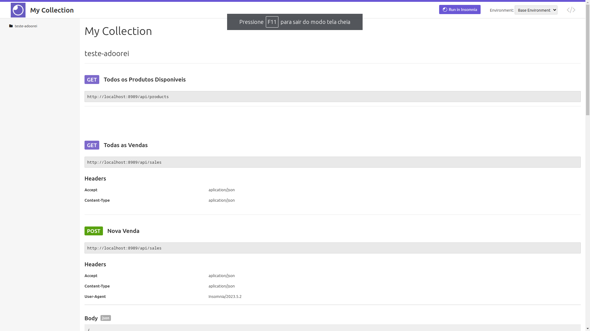

<p align="center"><a href="https://laravel.com" target="_blank"></a></p>

<p align="center">
<a href="https://github.com/laravel/framework/actions"></a>
<a href="https://packagist.org/packages/laravel/framework"></a>
<a href="https://packagist.org/packages/laravel/framework"></a>
<a href="https://packagist.org/packages/laravel/framework"></a>
</p>

# Documentação da API de Vendas




### Esta API permite gerenciar vendas e produtos.

Produtos
Listar Produtos

```
GET /api/products
```
Retorna todos os produtos disponíveis.

```
{
		"id": 3,
		"name": "Schaden PLC Perspiciatis",
		"price": "7576.36",
		"description": "Libero doloremque vel et maxime.",
		"created_at": "2024-03-06T00:32:22.000000Z",
		"updated_at": "2024-03-06T00:32:22.000000Z"
	},
	{
		"id": 4,
		"name": "Bernier-Labadie Temporibus",
		"price": "8903.89",
		"description": "Natus corrupti ut asperiores veritatis inventore aut quia.",
		"created_at": "2024-03-06T00:32:22.000000Z",
		"updated_at": "2024-03-06T00:32:22.000000Z"
	},

```
Criação de Venda
```
POST /api/sales
```
Cria uma nova venda com os produtos fornecidos.

Corpo da Requisição:

```
{
    "products": [
        {
            "product_id": "ID_DO_PRODUTO",
            "quantity": "QUANTIDADE"
        },
        {
            "product_id": "ID_DO_PRODUTO",
            "quantity": "QUANTIDADE"
        }
    ]
}
```

Listar Vendas

```
GET /api/sales
```
Retorna todas as vendas com os produtos associados.

```
{
		"id": 7,
		"amount": "7576.36",
		"created_at": "2024-03-06T00:39:10.000000Z",
		"updated_at": "2024-03-06T00:39:10.000000Z",
		"products": [
			{
				"id": 3,
				"name": "Schaden PLC Perspiciatis",
				"price": "7576.36",
				"description": "Libero doloremque vel et maxime.",
				"created_at": "2024-03-06T00:32:22.000000Z",
				"updated_at": "2024-03-06T00:32:22.000000Z",
				"pivot": {
					"sale_id": 7,
					"product_id": 3
				}
			}
		]
	},
```

Detalhes da Venda

```
GET /api/sales/{id}
```
Retorna os detalhes de uma venda específica com base no ID fornecido.

```{
  "products": [
    {
      "product_id": 3,
      "quantity": 1
    },
		{
			"product_id": 5,
      "quantity": 1
		}
  ]
}
```

Cancelar Venda
```
DELETE /api/sales/{id}
```
Cancela uma venda com base no ID fornecido.


Adicionar Produto a uma Venda
```
POST /api/sales/{id}/add-product
```
Adiciona um produto a uma venda existente.

```
{
    "product_id": "ID_DO_PRODUTO",
    "quantity": "QUANTIDADE"
}
```
Exemplo de Uso
Criação de Venda

```
POST /api/sales
```
Corpo da Requisição:

```
{
    "products": [
        {
            "product_id": 1,
            "quantity": 2
        },
        {
            "product_id": 2,
            "quantity": 1
        }
    ]
}
```
Resposta da Criação de Venda
```
{
    "sales_id": 1,
    "amount": 250.00,
    "products": [
        {
            "product_id": 1,
            "name": "Produto 1",
            "price": 100.00,
            "quantity": 2
        },
        {
            "product_id": 2,
            "name": "Produto 2",
            "price": 50.00,
            "quantity": 1
        }
    ]
}
```
# Instruções  para Execução do Projeto

Este é um guia passo a passo para configurar e executar o projeto Teste-Agenda localmente usando Docker.

Pré-requisitos
Docker Desktop instalado e configurado na sua máquina.
Git instalado na sua máquina.
Instalação
Clone o repositório do projeto Teste-Agenda do GitHub:

```
git clone https://github.com/newtoncutrim/teste-adoorei.git
```
Navegue até o diretório do projeto clonado:
```
cd teste-adoorei
```

## Usando Makefile, Automatizado.

Esse comando vai fazer todo processo  de build da imagem docker e configurar o ambiente  necessário para rodar as aplicação. Incluindo a Seed os Testes e configuração do .env. Se preferir deixei os comandos para fazer manualmente a baixo!.
```
make start 
```

## Manualmente
Execute o seguinte comando para iniciar os contêineres Docker e construir as imagens:
```
docker compose up -d --build
```
Instale as dependências do Composer executando o seguinte comando:
```
docker compose exec app composer install
```
Copie o arquivo de ambiente de exemplo .env.example para .env:
```
docker compose exec app cp .env.example .env
```
Gere a chave de criptografia do Laravel executando o seguinte comando:
```
docker compose exec app php artisan key:generate
```
Configure o banco de dados no arquivo .env com as seguintes credenciais:
```
DB_CONNECTION=mysql
DB_HOST=db
DB_PORT=3306
DB_DATABASE=laravel
DB_USERNAME=root
DB_PASSWORD=root
```
Execute as migrações do banco de dados com o seguinte comando:
```
docker compose exec app php artisan migrate
```
Execute a Seed de Produtos
```
docker compose exec app php artisan db:seed
```
Execute os Testes Unitarios
```
 docker compose exec app php artisan test   
```
Acesso Local
Depois de seguir as etapas acima, você pode acessar o projeto Teste-Adoorei localmente no seguinte endereço:

http://localhost:8989/
